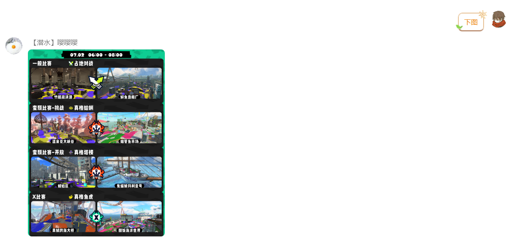
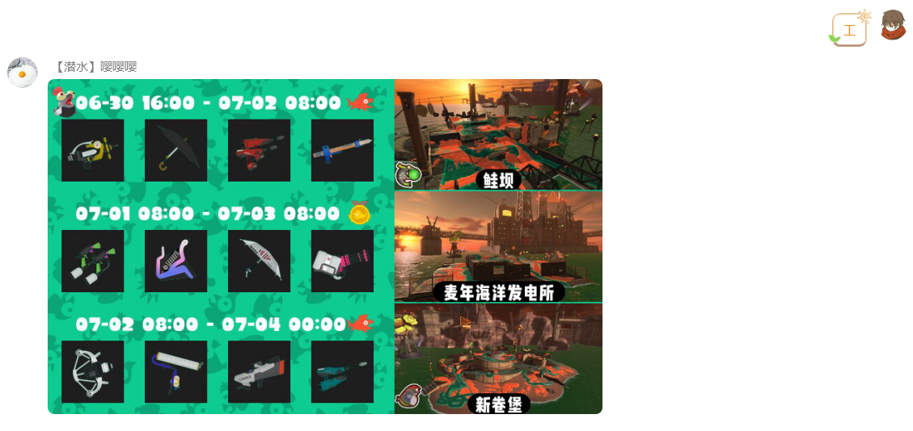
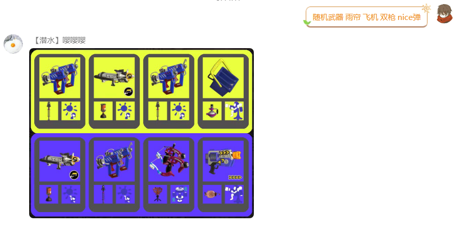
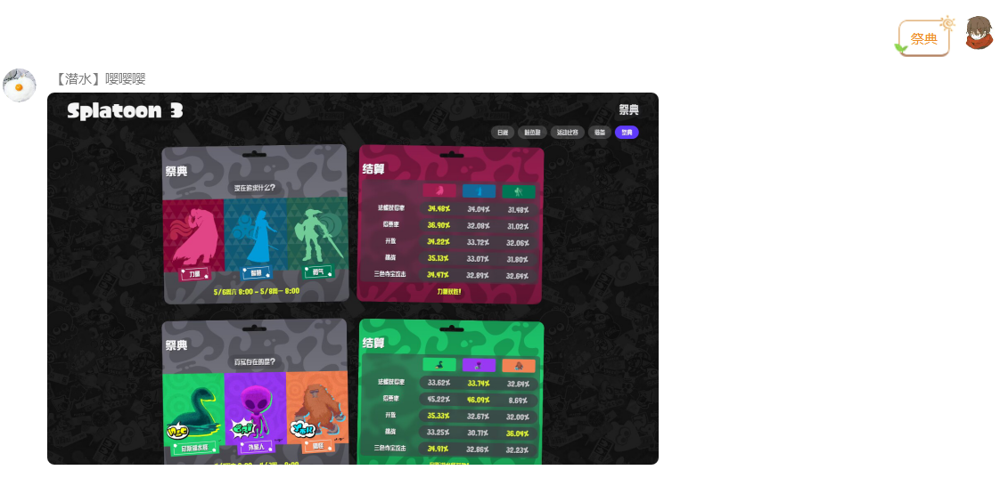
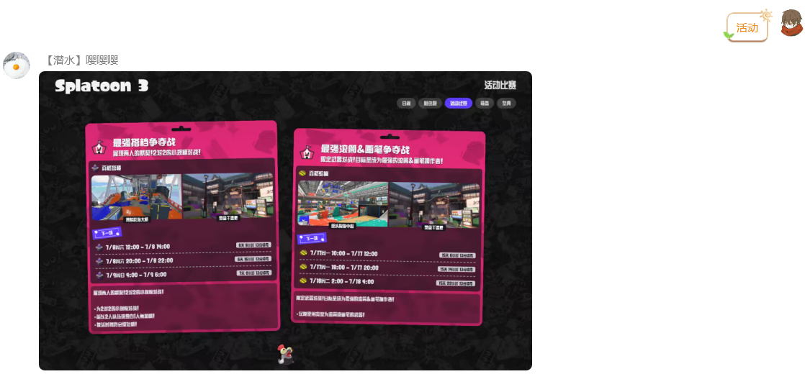

# Splatoon 3 地图查询插件

> QQ 机器人 SplatBot 已搭载该插件，可以[点击这里](https://flawless-dew-f3c.notion.site/SplatBot-e91a70e4f32a4fffb640ce8c3ba9c664)查看使用指南

## 说明
- 本插件为适配[nonebot2框架](https://github.com/nonebot/nonebot2)的机器人插件,nonebot2框架具体安装方式可自行搜索，推荐环境为gocq+nonebot2
- 本插件的命令都不需要触发前缀，同时也兼容`/`，`\ `,`,`,`.`,`。`这些触发前缀
- 除随机武器和祭典，活动等截图实现的功能外，其他功能的查询图片都会自动在对战规则的2h时段内缓存，缓存有效期内的图片无需重新生成，大大省去绘图时间

## 已实现功能
### 对战地图查询
1. 简单地图查询：
    - `图`：查询当前时段图
    - `下图`：查询下个时段图，或者`下下下下图`，多个`下`，或多个`图`，都是可以的
    - `全部图`:查询现在到未来6个时段的对战地图(渲染太慢了，发个超级长图也不会有人看的)
    - 
2.	选择时段查询： 举例：可以通过`023图`来查询当前时段(0)、下下个时段(2)、下下下个时段的地图(3)
    - 
3.	对战模式规则筛选查询：举例:`塔楼`:默认会给出下个时段是塔楼的模式，如果哪个模式都没有塔楼，会发送未来12h内的全部塔楼图
    - `挑战`，`塔楼`，`涂地`，`开放蛤蜊`，这些单筛选或双筛选都是支持的
    - 上面查询地图时用到的`下`，`全部`，`0234`,这三类前缀词，在对战筛选也同样可以用，如`全部开放塔楼`
    - 支持语义转换，一些常用的同义词，如`pp`，`排排`，`抢鱼`，`真格`等，同样可以使用，如`pp蛤蜊`
    - 

4. 祭典期间的地图查询暂未适配，可能导致没有图片结果，以及报错信息，这个会在下次举行祭典时修复

### 打工地图查询

1. `工`，`打工`，`团队打工`，`bigrun`等这些词都能触发
2. 如果存在团队打工或bigrun，也会在打工列表内进行显示，并根据时间自动排序
3. 查看从当期开始后连续 5 期工的信息：`全部工`，`全部打工`等
 

### 其他功能

1.随机武器功能:`随机武器`,后面可以加上至多四个筛选参数，两边队伍应用的筛选参数会一致，多个参数间用空格分开，如`随机武器 雨帘 飞机 双枪 nice弹`
   - 参数包括 武器类别名称，如`小枪`，`弓`，`双枪`等;副武器名称，如`三角雷`，`水球`，`雨帘`等;大招名称，如`nice弹`，`rpg`，`龙卷风`等，
   - 支持语义转换，无论官方的正式名称和这些俗称，都可以视为参数，大部分能想到的语义词都有包括，具体语义表见[翻译文件](https://github.com/Skyminers/Bot-Splatoon3/blob/56a1f704d1031883a2db678c6224842616de23b9/nonebot_plugin_splatoon3/translation.py#L204)
   - 如果不带参数或参数小于4，剩下的会自动用 `同一大类下的武器`进行筛选，如`狙`和`加特林`都属于`远程类`，`小枪`与`刷子`，`滚筒`等属于`近程类`(这个没办法做到每把武器进行不同标记，工作量太大了，只能将武器整体类型进行标记，来保证相对公平)
   - 没有匹配到的参数名称，会使用`同一大类下的武器`进行筛选，你也可以通过向[翻译文件](https://github.com/Skyminers/Bot-Splatoon3/blob/56a1f704d1031883a2db678c6224842616de23b9/nonebot_plugin_splatoon3/translation.py#L204)提交pr来添加更多语义词
   - 如果不希望进行任何限制，也可以发送`随机武器完全随机`，来触发不加限制的真随机武器(平衡性就没法保证了)
   - 
2.查看祭典:`祭典`，此功能通过网页截图实现，功能可能不稳定，后续会重置为pil绘图
   - 
3.查看活动:`活动`，此功能通过网页截图实现，功能可能不稳定，后续会重置为pil绘图
   - 
4.查看nso当前售卖装备`装备`或`衣服`，此功能通过网页截图实现，功能可能不稳定，后续会重置为pil绘图
   - 
5.管理员功能:机器人的管理员可以使用以下命令
   - `清空图片缓存`:会主动清空2h内的全部缓存图
   - `更新武器数据`:首次使用时，必须先运行一次这个命令，来更新武器数据库，不然随机武器功能无法使用
---

## 安装指南

### 手动安装

```shell
git clone https://github.com/Skyminers/Bot-Splatoon3.git
```

在 nonebot2 框架中，将本仓库代码内的`nonebot_plugin_splatoon3`文件夹置于插件目录(`src/plugins`)即可正常加载，
之后对机器人发送`更新武器数据`来更新数据库内的武器数据，不然`随机武器`功能无法使用

