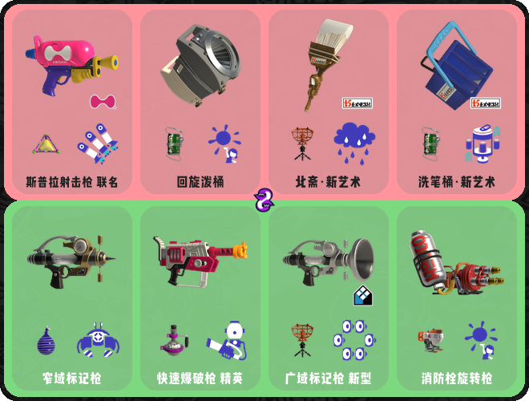

<div align="center">
  <a href="https://v2.nonebot.dev/store"></a>
  <br>
  <p></p>
</div>

<div align="center">

# nonebot-plugin-splatoon3

_✨ splatoon3游戏日程查询插件 ✨_

<p align="center">
<a href="./LICENSE">
    
</a>
<a href="https://pypi.python.org/pypi/nonebot-plugin-splatoon3">
  
</a>
<a href="https://pypi.python.org/pypi/nonebot-plugin-splatoon3">
    
</a>

<br />
<a href="https://onebot.dev/">
  
</a>
<a href="https://onebot.dev/">
  
</a>
<a href="https://github.com/nonebot/adapter-telegram">

</a>
<a href="https://github.com/Tian-que/nonebot-adapter-kaiheila">

</a>
<a href="https://github.com/nonebot/adapter-qq">

</a>
</p>

</div>


## 📖 介绍

- 一个基于nonebot2框架的splatoon3游戏日程查询插件,支持onebot11,onebot12,[telegram](https://github.com/nonebot/adapter-telegram)协议,[kook](https://github.com/Tian-que/nonebot-adapter-kaiheila)协议,[QQ官方bot](https://github.com/nonebot/adapter-qq)协议
- onebot12协议下支持QQ、QQ频道、QQ官方bot、TG、微信消息、微信公众号、KOOK 等[平台](https://onebot.dev/ecosystem.html)
- 全部查询图片,全部采用pillow精心绘制,图片效果可查看下面的[效果图](#效果图)
> 也可以邀请我目前做好的bot直接加入频道，[kook频道bot](https://www.kookapp.cn/app/oauth2/authorize?id=22230&permissions=4096&client_id=4Kn4ukf1To48rax8&redirect_uri=&scope=bot),[qq频道bot](https://qun.qq.com/qunpro/robot/share?robot_appid=102083290),[qq群聊bot](https://qun.qq.com/qunpro/robot/qunshare?robot_appid=102083290&robot_uin=3889005657)

## 💿 安装

<details>
<summary>使用 nb-cli 安装</summary>
在 nonebot2 项目的根目录下打开命令行, 输入以下指令即可安装

    nb plugin install nonebot-plugin-splatoon3

</details>


<details>
<summary>使用包管理器安装</summary>
在 nonebot2 项目的插件目录下, 打开命令行, 根据你使用的包管理器, 输入相应的安装命令
<details>
<summary>pdm</summary>

    pdm add nonebot-plugin-splatoon3
</details>

<details>
<summary>poetry</summary>

    poetry add nonebot-plugin-splatoon3
</details>

</details>


## ⚙️ 配置
插件访问了`splatoon3.ink`和`splatoonwiki.org`这两个网站,如果机器人所处环境不支持直接访问这两个网站

可以在 nonebot2 项目的`.env.prod`文件中添加下表中的代理地址配置项

| 配置项 | 必填 | 值类型 | 默认值 | 说明 |
|:------:|:----:|:---:|:---:|:--:|
| splatoon3_proxy_address | 否 | str | ""  | 代理地址，格式为 127.0.0.1:20171 |
| splatoon3_reply_mode | 否 | bool | False  | 指定回复模式，开启后将通过触发词的消息进行回复，默认为False |
| splatoon3_permit_private | 否 | bool | False  | 是否允许频道私聊触发，默认为False |
| splatoon3_permit_c2c | 否 | bool | False  | 是否允许qq私聊(c2c)触发，默认为False |
| splatoon3_permit_channel | 否 | bool | True  | 是否允许频道触发，默认为True |
| splatoon3_permit_group | 否 | bool | True  | 是否允许群聊(如qq群，tg群)触发，默认为True |
| splatoon3_permit_unknown_src | 否 | bool | False  | 是否允许未知来源触发，默认为False |
| splatoon3_sole_prefix | 否 | bool | False  | 限制消息触发前缀为/ |
| splatoon3_guild_owner_switch_push | 否 | bool | False  | 频道服务器拥有者是否允许开关主动推送功能(为False时仅允许管理员开启关闭) |

<details>
<summary>示例配置</summary>
  
```env
# splatoon3示例配置
splatoon3_proxy_address = "" #代理地址
splatoon3_reply_mode = False #指定回复模式
splatoon3_permit_private = False #是否允许频道私聊触发
splatoon3_permit_c2c = False #是否允许qq私聊(c2c)触发
splatoon3_permit_channel = True #是否允许频道触发
splatoon3_permit_group = True # 是否允许群聊(如qq群，tg群)触发
splatoon3_permit_unkown_src = False #是否允许未知来源触发
splatoon3_sole_prefix = False # 限制消息触发前缀为/
splatoon3_guild_owner_switch_push = False # 频道服务器拥有者是否允许开关主动推送功能(为False时仅允许管理员开启关闭)
```

</details>

## 🎉 使用
### 指令表
<details>
<summary>指令帮助手册</summary>


</details>


### 效果图
<details>
<summary>对战查询</summary>


</details>
<details>
<summary>打工查询</summary>


</details>
<details>
<summary>活动</summary>


</details>
<details>
<summary>祭典</summary>


</details>
<details>
<summary>随机武器</summary>



</details>

## ✨喜欢的话就点个star✨吧，球球了QAQ

## ⏳ Star 趋势

[](https://starchart.cc/Skyminers/nonebot-plugin-splatoon3)
