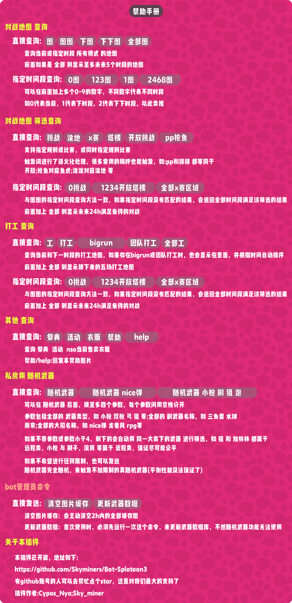
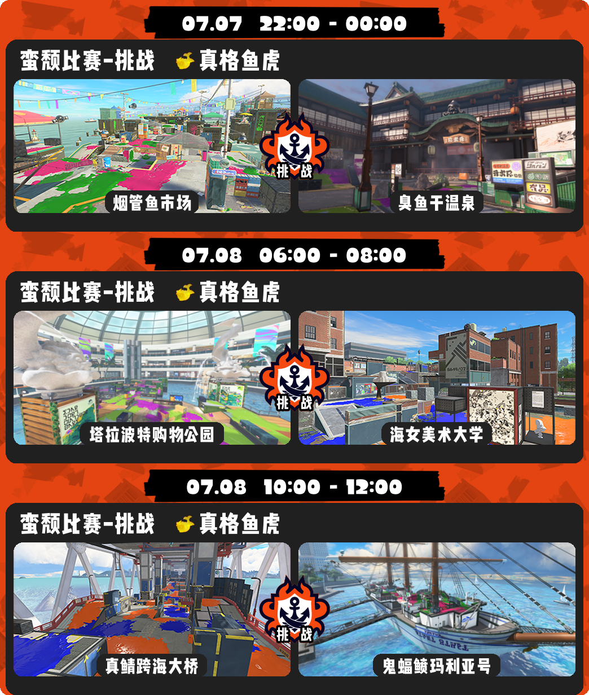
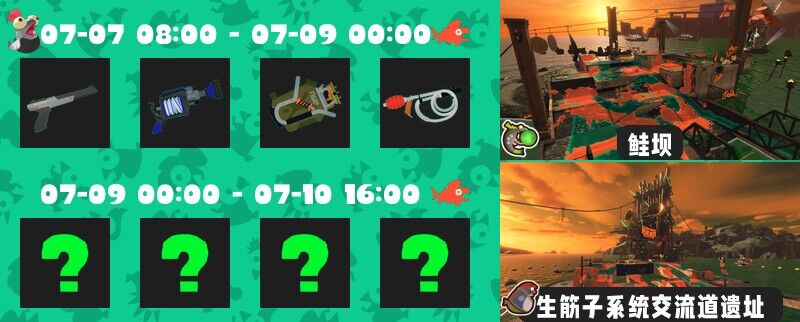
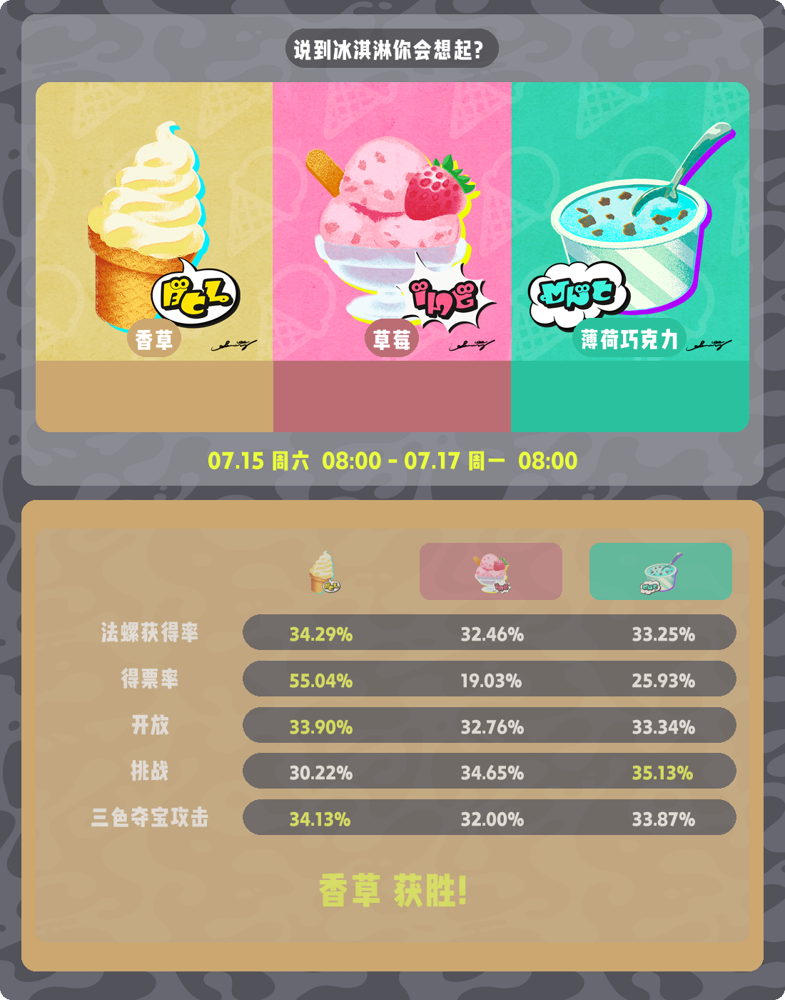

  
   
  

# nonebot-plugin-splatoon3

_✨ splatoon3游戏日程查询插件 ✨_

## 📖 介绍

- 一个基于nonebot2框架的splatoon3游戏日程查询插件,支持onebot11,onebot12,[telegram](https://github.com/nonebot/adapter-telegram)协议
- onebot12协议下支持QQ、QQ频道、TG、微信消息、微信公众号、KOOK 等[平台](https://onebot.dev/ecosystem.html)
- 全部查询图片(除nso衣服查询外),全部采用pillow精心绘制,图片效果可查看下面的[效果图](#效果图)
> QQ 机器人 SplatBot 已搭载该插件，可以[点击这里](https://flawless-dew-f3c.notion.site/SplatBot-e91a70e4f32a4fffb640ce8c3ba9c664)查看qq机器人使用指南

## 💿 安装

使用 nb-cli 安装

在 nonebot2 项目的根目录下打开命令行, 输入以下指令即可安装

    nb plugin install nonebot-plugin-splatoon3

使用包管理器安装

在 nonebot2 项目的插件目录下, 打开命令行, 根据你使用的包管理器, 输入相应的安装命令

pdm

    pdm add nonebot-plugin-splatoon3

poetry

    poetry add nonebot-plugin-splatoon3

安装完成后，需要以onebot协议下超级管理员用户对机器人发送`更新武器数据`来更新数据库内的武器数据，不然`随机武器`功能无法使用

## ⚙️ 配置
插件访问了`splatoon3.ink`和`splatoonwiki.org`这两个网站,如果机器人所处环境不支持直接访问这两个网站

可以在 nonebot2 项目的`.env.prod`文件中添加下表中的代理地址配置项

| 配置项 | 必填 | 值类型 | 默认值 | 说明 |
|:------:|:----:|:---:|:---:|:--:|
| splatoon3_proxy_address | 否 | str | ""  | 代理地址，格式为 127.0.0.1:20171 |
| splatoon3_permit_private | 否 | bool | True  | (仅onebotv11协议生效)是否允许qq私聊触发，默认为True |
| splatoon3_reply_mode | 否 | bool | False  | (onebotv11,onebotv12,telegram协议)指定回复模式，开启后将通过触发词的消息进行回复，默认为False |

## 🎉 使用
### 指令表

指令帮助手册

### 效果图

对战查询

打工查询

活动

祭典

随机武器

## ✨喜欢的话就点个star✨吧，球球了QAQ
